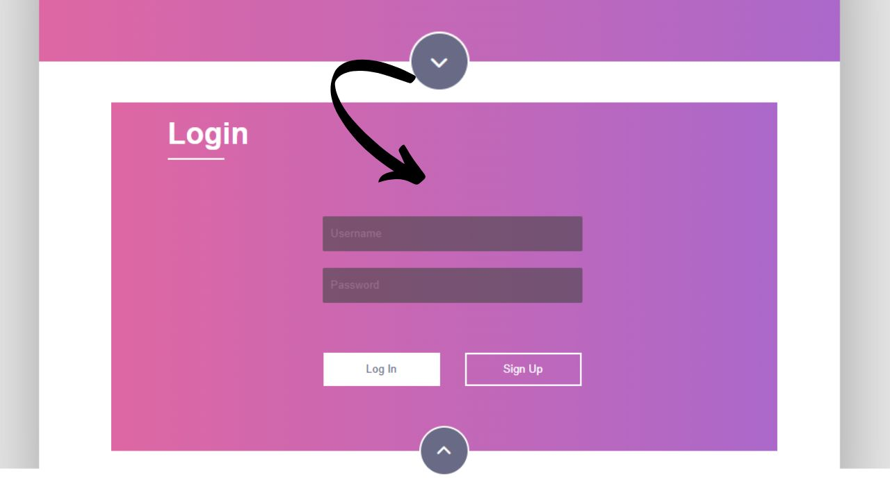

# Creative Community Login Form



A stylish, interactive login form with gradient backgrounds, toggle reveal effect, and real-time validation. Built step-by-step using **HTML5, CSS3, JavaScript**, and **ChatGPT-assisted development**.

---

## Features
- ✔️ Gradient background design
- ✔️ Toggle reveal login form with smooth transitions
- ✔️ Username & password validation with error messages
- ✔️ Interactive buttons with hover effects
- ✔️ Font Awesome icons for UI polish
- ✔️ Professional folder structure (HTML, CSS, JS separated)
- ✔️ AI-assisted coding workflow with ChatGPT

---

## Live Demo
[View Live Demo](https://YourUsername.github.io/AI_Dev_LoginForm_2/)

---

## Development Prompt History

This project was created through an **iterative AI-assisted development process** with ChatGPT.
Below are the **exact prompts used** during development:

### Initial Prompt
```
Generate the standard HTML5 boilerplate code. Set the title to 'Creative Community Login'. Include the necessary meta tags for character set, X-UA compatibility, description, and viewport. Also, link the Font Awesome 5 CSS from the CDN using https://cdnjs.cloudflare.com/ajax/libs/font-awesome/5.15.3/css/all.min.css. The body should be empty for now.
```

### Enhancement 1
```
Inside the <body>, create the main structure. First, create a div with a class of wrapper. Inside it, create two main sections: [login-text section with form + call-text section].
```

### Enhancement 2
```
Using the HTML structure we defined, write the CSS. First, style the body with the font family 'Raleway', sans-serif and a background color of #e7e7e7. Next, style the .wrapper class with fixed size, centering, shadow, and overflow hidden.
```

### Enhancement 3
```
Now, style the .login-text class with gradient background, hidden position, padding, transitions, and form styling. Add styles for inputs, error messages, buttons, and the circular .cta button.
```

### Enhancement 4
```
Style the .call-text section with white background, centered text, gradient button, and hover effects.
```

### Enhancement 5
```
Create utility classes: .show-hide (display:block), .expand (translateY(300px)), and style .error-message with red text, small font, centered, hidden by default.
```

### Enhancement 6
```
Write the JavaScript for the page's interactivity. Add a click listener on the .cta button to toggle form visibility, expand animation, and icon change.
```

### Enhancement 7
```
Add form validation: prevent default, check username and password fields, display error messages, require password length >= 8, and show success alert if valid.
```

### Enhancement 8
```
Add event listeners to the Sign Up and Join the Community buttons:
- Sign Up → alert "Redirecting to sign up page..."
- Join → if form hidden, auto-click .cta, then alert "Join our creative community!"
```

### Final Enhancement
```
Reorganize the code into a professional folder structure with index.html, css/styles.css, and js/javascript.js. Link them properly in the HTML.
```

---

## Project Structure
```
AI_Dev_2/
├── index.html
├── css/
│   └── styles.css
├── js/
│   └── javascript.js
├── README.md
└── AI_Dev_2.1.jpg
```

---

## Technologies Used
- **HTML5** (semantic markup)
- **CSS3** (gradients, transitions, flexbox)
- **JavaScript** (DOM manipulation, validation, event handling)
- **Font Awesome 6** (icons)
- **GitHub Pages** (hosting demo)
- **ChatGPT** (AI-assisted development)

---

## How to Use
1. Clone the repository:
   ```bash
   git clone https://github.com/EdmondGoddy/AI_Dev_LoginForm_2
   ```
2. Open `index.html` in your browser.
3. Click the **chevron button** to reveal the form.
4. Try submitting with empty fields or short passwords to test validation.

---

## Customization
- 🎨 Change gradient colors in `css/styles.css`:
```css
background: linear-gradient(to left, #ab68ca, #de67a3);
```
- 🖋️ Adjust form width/height in `.wrapper` class.
- 🔔 Replace `alert()`s in `js/javascript.js` with real **redirects** or API calls.

---

## License
MIT License – Free to use and modify for personal and commercial projects.
